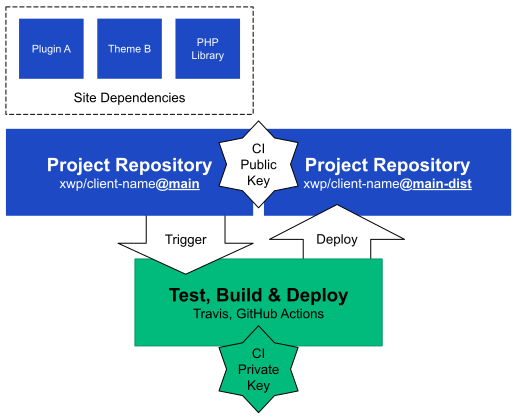

# Deployments

Most of our hosting partners offer Git repositories for deploying code to their infrastructure. 

However, the development related code and tooling shouldn't be uploaded to the production servers so we introduce **a build and deploy process** which:

* installs project dependencies,
* runs tests to confirm the functionality of the project, 
* builds the distribution versions of all assets such as JS and CSS,
* removes development-only source code, helpers and tooling,
* deploys the release bundle to the production environment.

In reality, it could look like the following sequence of scripts:

* `npm install`
* `npm run test`
* `npm run build`
* `npm run release`
* `npm run deploy`

All tooling to run the build and deploy process should be engineered in a way that is agnostic to the automation platform used for running the checks and deployments. This ensures that the whole process can be verified and tested locally, and ported to different automation systems without changing the core functionality. The main concern of the automation platform is to setup the platform-level dependencies such as the correct version of PHP, Node.js and Docker to ensure that the scripts bundled with the project can run.

### Access Management for Deployments

Automated build and deploy tooling needs access both to the source code and the deploy target repositories. In case of Git repositories the access is managed via SSH keys where the private part of the key is known only to the party accessing the code while the matching public key is added to the repositories.

#### Unique SSH Keys

It is important that the SSH key pair is limited only to the repositories that are needed for the specific project and that the keys are not reused between projects. This ensures that a compromised key can't impact the workflows of other projects.

Use the following command to generate a new SSH key pair:

```text
ssh-keygen -m PEM -t rsa -b 4096 -C "technology+PROJECT_KEY@xwp.co"
```

where:

* `-m PEM` sets the output format PEM,
* `-t rsa` sets the key format to RSA,
* `-b 4096` sets the key length to 4096 bytes while
* `-C technology+PROJECT_KEY@xwp.co` is free-form comment to designate the project association.

Keys that are used for automation usually don't require a passphrase so that step can be skipped during the key generation. The path where to generate the keys can be anything as long as you're able to find them afterwards. Make sure _to not override_ any existing keys on your machine such as `~/.ssh/id_rsa`. Some automation systems support newer SSH key algorithms such as `Ed25519` in which case the `-m PEM` flag can be omitted.

The command generates two new files, if `key_name` was specified as the key name:

* `key_name` is the private part \(secret\) of the key which should be added to the automation platform \(Travis CI, GitHub Action, Circle CI\) that needs access to the protected resources -- source code and the deployment target repositories. See the setup instructions for [GitHub Actions](https://github.com/marketplace/actions/checkout#usage), [Travis CI](https://docs.travis-ci.com/user/private-dependencies/#using-an-existing-key) and [Circle CI](https://circleci.com/docs/2.0/add-ssh-key/).
* `key_name.pub` is the matching public key which should be added to all Git repositories that should be accesible by the computer possessing the private key such as the source and deployment repositories. See instructions for [VIP Go \(same as any GitHub repository\)](https://docs.github.com/en/developers/overview/managing-deploy-keys), [Pantheon](https://pantheon.io/docs/ssh-keys) and [WP Engine](https://wpengine.com/support/git/#Add_SSH_Key_to_User_Portal).

#### Machine Users for Projects with Multiple Private Dependencies

For projects with multiple private dependencies it might be easier to use a dedicated GitHub user since GitHub deploy keys can't be re-used on multiple GitHub repositories. These are sometimes called "machine users" since they are only a convenience for the deployment as the user can be added to all relevant private repositories with the necessary permissions. For example, the public part of the SSH key is added to the [SSH keys of a machine user](https://docs.github.com/en/github/authenticating-to-github/connecting-to-github-with-ssh/adding-a-new-ssh-key-to-your-github-account) `machine-user` on GitHub and then the `machine-user` is [invited to all the necessary repositories](https://docs.github.com/en/github/setting-up-and-managing-your-github-user-account/managing-access-to-your-personal-repositories/inviting-collaborators-to-a-personal-repository) so that any client authenticating with the key is now recognized as the `machine-user` with its access permissions.

### Source and Release Repositories

While our hosting partners provide Git repositories for tracking the production code, sometimes it is useful to keep a local source repository in our GitHub organization and use the host repository only as the release target.

Using a local source repository provides the following benefits:

* Add and remove project contributors without giving them access to the production environments.
* Track development files and limit what is deployed to the publicly accessible release repository.
* Use any automation workflow when developing, testing and deploying the project.

Both Pantheon and WP VIP offer ways to hide files from public access through either special "protected" directories --`/private` [on WP VIP](https://docs.wpvip.com/technical-references/vip-codebase/private-directory/) and [private paths](https://pantheon.io/docs/private-paths) or [dedicated `/web` sub-directory](https://pantheon.io/docs/nested-docroot) on Pantheon. It is unknown how to do this on WP Engine.

Note that VIP Go supports [using branches with `-built` suffix for tracking the release files](https://docs.wpvip.com/technical-references/development-workflow/automated-build-and-deploy/#h-pushing-code-to-branches) so the non-built branches can be used similar to a local source repository. This is a feature that must be enabled by VIP support after you've created the necessary branches -- `master-built` for production and `develop-built` for staging.

#### Deploy to a Different Release Repository

Here is an illustration of the build and deployment process when a project is deployed to a release repository which is different from the source repository. A dedicated SSH key-pair is used to authenticate the automation tooling with both repositories for read and write access.


#### Deploy to a Branch in the Same Source Repository

The workflow is very similar when the same repository is used for both development and deployments:



### Platform Specific Instructions

* See the [VIP Go site template](https://github.com/xwp/vip-go-site) for [WordPress VIP](https://wpvip.com/) specific instructions.

